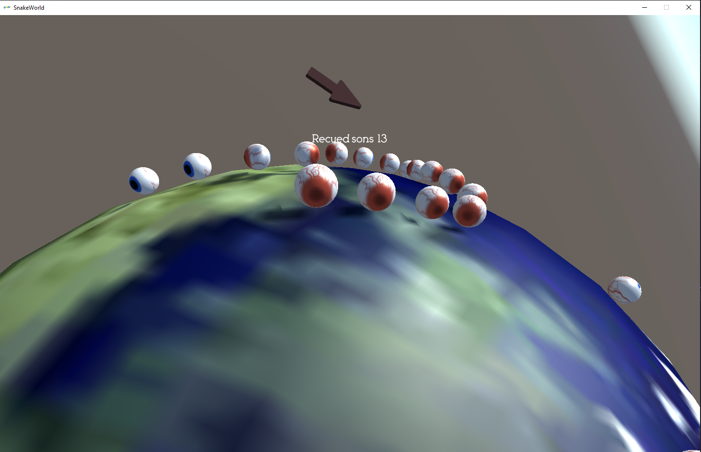
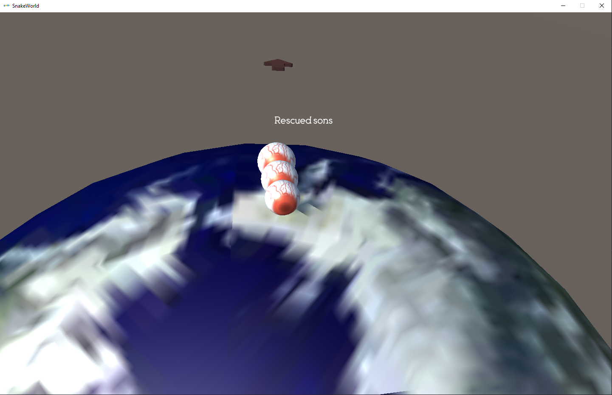

# SnakeWorld
Challenge project, creating a snake game in Unity3D (an engine never used by me), in just a day without help

## PARA JOGAR:
    Open the folder BUILD and execute the "SnakeWoruld.exe"

### O que foi feito

- [x] Manipulation of the first 3D objects
- [x] Manipulation of a globe with gravity
- [x] Rudimentary implementation of Spawn
- [x] An arrow that points to the newer spawn's
- [x] Rudimentary manipulation of a HUD with node count

